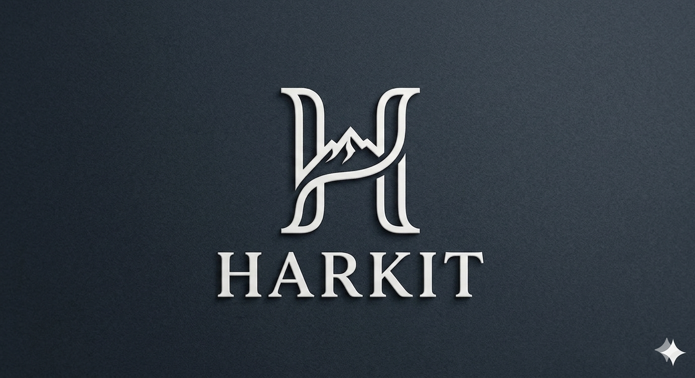

<p align="center">
  
</p>

<h1 align="center">Harkit Singh</h1>
<h3 align="center">Full Stack Developer Portfolio</h3>

<p align="center">
  <a href="https://portfolio-8zov.onrender.com" target="_blank">Live Portfolio</a> ·
  <a href="https://github.com/Harkit07" target="_blank">GitHub</a> ·
  <a href="https://www.linkedin.com/in/harkit-singh/" target="_blank">LinkedIn</a>
</p>

A portfolio website built with React and Vite to showcase my projects, technical skills, certifications, education, and resume. It is designed to present my work in a clean, modern, and professional way for recruiters and collaborators.

## 🌐 Live Demo

Visit the live portfolio here:

- [Harkit Singh Portfolio](https://portfolio-8zov.onrender.com)

This deployed version reflects the latest portfolio updates and is the easiest way to view the project in production.

---

## ✨ Features

- Modern dark-themed portfolio UI with glassmorphism styling
- Responsive design for mobile, tablet, and desktop screens
- Section-based layout for About, Experience, Projects, Skills, Certifications, and Education
- Downloadable resume PDF and embedded PDF preview
- Dynamic content management from `src/data.js`
- Project cards with live demo and GitHub links
- Social and professional profile links in the hero and footer sections

---

## 🛠️ Tech Stack

| Technology | Purpose |
| --- | --- |
| React 19 | Frontend UI |
| Vite | Development and build tooling |
| Tailwind CSS | Utility-first styling |
| Framer Motion | Scroll and fade animations |
| Lucide React | Interface icons |
| JavaScript (ES6+) | Application logic |

---

## 📁 Project Structure

```text
Portfolio/
├── public/
│   ├── Img.png                     # Logo
│   ├── HarkitSinghResume.pdf      # Resume PDF
│   ├── Certificate FullStack.pdf  # Full Stack Certificate
│   ├── Certificate Java DSA.pdf    # Java DSA Certificate
│   └── ...
├── src/
│   ├── App.jsx                    # Main portfolio page
│   ├── data.js                    # Portfolio data
│   ├── main.jsx                   # App entry point
│   ├── index.css                  # Global styles
│   └── App.css                    # Additional styles
├── package.json
├── vite.config.js
├── index.html
├── README.md
├── .gitignore
└── dist/                         # Build output
```

---

## 🚀 Getting Started

### Prerequisites

- Node.js 18+
- npm 9+

### Install and run locally

```bash
git clone https://github.com/Harkit07/Portfolio.git
cd Portfolio
npm install
npm run dev
```

Open:

```text
http://localhost:5173
```

### Production build

```bash
npm run build
```

The output is generated in the `dist/` folder, ready for deployment.

---

## 🧩 Portfolio Data

The portfolio content is centralized in `src/data.js`, which includes:

- `basics` — name, title, summary, email, phone, and links
- `skills` — categorized technical skill groups
- `achievements` — notable achievements and milestones
- `projects` — project cards with dates, stack, and descriptions
- `education` — academic details
- `certificates` — downloadable PDF certs

This makes it easy to update the site without modifying the page structure.

---

## 🌐 Featured Projects

### AI Assistant (ChatGPT Clone)

**Tech Stack:** MERN, Docker, Kubernetes, OpenAI API, JWT, GitHub Actions

- Built a full-stack AI chat application with persistent chat threads and protected authentication
- Integrated OpenAI responses with markdown and code block support
- Added conversation history, user session management, and secure API access
- Deployed using Docker, Kubernetes, and NGINX Ingress

🔗 [Live Demo](https://ai-assistant-nsg8.onrender.com/)

### Boutique — E-Commerce Platform

**Tech Stack:** MERN, JWT, Cloudinary, Multer, Material UI

- Created a boutique ecommerce platform with auth, cart, product management, and account flow
- Added secure JWT auth, password-hashing, and protected routes
- Integrated Cloudinary for product image uploads and storage
- Delivered a polished shopping experience for browsing and purchasing

🔗 [Live Demo](https://ravneetboutique.qzz.io/)

### Wanderlust — Property Listings Platform

**Tech Stack:** Node.js, Express, EJS, MongoDB, Mapbox, Cloudinary, GitHub Actions

- Built an Airbnb-inspired travel listing app with CRUD operations and property review support
- Integrated Mapbox for listing locations and interactive geolocation maps
- Added auth, session handling, and authorization for listing owners and reviewers
- Set up testing and deployment checks with GitHub Actions

🔗 [Live Demo](https://wanderlust-jade-sigma.vercel.app/listings)

---

## 📄 Resume and Certifications

The portfolio includes:

- Downloadable resume: `public/HarkitSinghResume.pdf`
- Full Stack certificate: `public/Certificate FullStack.pdf`
- Java DSA certificate: `public/Certificate Java DSA.pdf`

These are linked in the site hero section and certifications area.

---

## 🌐 Links

- [Portfolio](https://portfolio-8zov.onrender.com)
- [GitHub](https://github.com/Harkit07)
- [LinkedIn](https://www.linkedin.com/in/harkit-singh/)
- [LeetCode](https://leetcode.com/u/Harkit07/)
- [GeeksforGeeks](https://www.geeksforgeeks.org/profile/harkit07?tab=activity)

---

## 🚢 Deployment

This portfolio is deployable on any static hosting platform, including:

- Vercel
- Netlify
- Render

Build command:

```bash
npm run build
```

Publish directory:

```text
dist
```

---

## 👨‍💻 Author

**Harkit Singh**

- Email: harkitsinghsran9584@gmail.com
- GitHub: https://github.com/Harkit07
- LinkedIn: https://www.linkedin.com/in/harkit-singh/

---

## 📝 License

This project is intended for personal portfolio use and can be adapted for similar developer portfolio projects.
